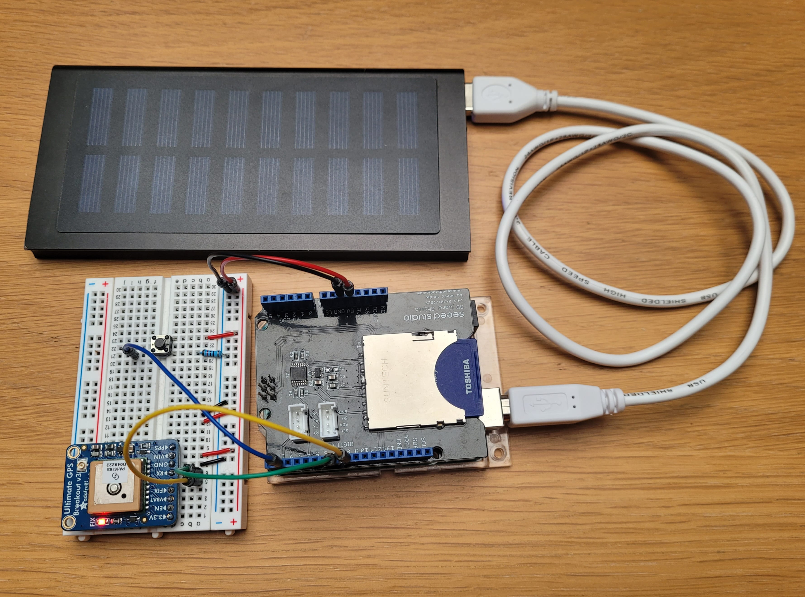

# Area-Unlocked (Project In-Progress)
(Currently this project is in its initial stage)

This project tracks your runs and overlays them on top of each other on a map, the goal is to run every possible route in a given area because you can't fast travel to a street you haven't explored yet.

The game is to choose an area that you want to explore and use this project to keep track of your progress.

[View the Interactive Map Here](https://szymonborkowski.github.io/Area-Unlocked)

# Instructions

### Collect Data
- Connect SD card shield, SD card, wires, resistor, and button as shown in system image below.
- Upload 'arduino_gps/arduino_gps.ino' file onto Arduino Uno.
- Collect GPS data of your journey using the Arduino and GPS system.
- Store all your journeys in the `journeys_gps/` directory.

### Run the Script
- Run the software to parse the NMEA sentences into .geojson files: `python data_parsing.py`

### View the Result
- Open `area_map.html` file.

# Journey Tracker (GPS Data System)
- This system will gather GPS coordinates from your journeys.

### Bill of Materials
- Required items include:
    - Arduino Uno
    - SD Card Shield (seeed studio v4.4)
    - SD card
    - GPS (adafruit Ultimate GPS Breakout v3)
    - Button
    - Resistor
    - Wires
    - Battery (Powerbank)
    - USB type A cable

### Physical System:

